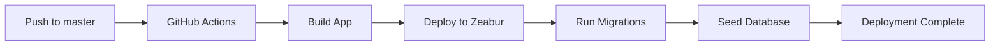

# CI/CD Deployment with GitHub Actions

Automated deployment to Zeabur using GitHub Actions and Zeabur CLI.

## Overview

The project includes a GitHub Actions workflow that automatically deploys to Zeabur when you push to the `master` branch.

**Workflow file**: `.github/workflows/deploy.yml`

## How It Works



## Setup Steps

### 1. Install GitHub CLI

```bash
# macOS
brew install gh

# Linux (Debian/Ubuntu)
sudo apt install gh

# Windows
winget install GitHub.cli
```

### 2. Authenticate with GitHub

```bash
gh auth login
```

Follow the prompts to authenticate.

### 3. Configure Secrets

**Quick Setup (Recommended)**:

```bash
./scripts/setup-github-secrets.sh
```

**Manual Setup**:

```bash
# Set each secret individually
gh secret set ZEABUR_TOKEN
gh secret set ZEABUR_PROJECT_ID
gh secret set ZEABUR_SERVICE_ID
gh secret set DATABASE_URL
gh secret set NEXTAUTH_SECRET
gh secret set NEXTAUTH_URL

# Optional OAuth secrets
gh secret set GOOGLE_CLIENT_ID
gh secret set GOOGLE_CLIENT_SECRET
gh secret set GITHUB_CLIENT_ID
gh secret set GITHUB_CLIENT_SECRET
```

### 4. Create Zeabur Project (First Time Only)

Before running the workflow, you need a Zeabur project:

1. Go to https://zeabur.com
2. Create new project
3. Add PostgreSQL service
4. Add Git service (connect your repo)
5. Note the Project ID and Service ID from URLs

### 5. Set Environment Variables in Zeabur

Set the same variables in Zeabur dashboard:

```env
DATABASE_URL=${POSTGRES_URL}
NEXTAUTH_SECRET=<same-as-github-secret>
NEXTAUTH_URL=https://your-app.zeabur.app
NODE_ENV=production
```

## Deployment Workflow

The workflow automatically runs on:

### Automatic Triggers

- **Push to master**: Deploys automatically
- **Pull request merge**: Deploys after merge

### Manual Trigger

You can also trigger manually:

1. Go to **Actions** tab in GitHub
2. Select **"Deploy to Zeabur"** workflow
3. Click **"Run workflow"**
4. Select branch and click **"Run workflow"**

## Workflow Steps

The deployment process:

1. ✅ **Checkout code** - Gets latest code
2. ✅ **Setup environment** - Node.js, pnpm
3. ✅ **Install dependencies** - `pnpm install`
4. ✅ **Generate Prisma Client** - `pnpm prisma:generate`
5. ✅ **Build application** - `pnpm build`
6. ✅ **Deploy to Zeabur** - Using Zeabur CLI
7. ✅ **Run migrations** - `npx prisma migrate deploy`
8. ✅ **Seed database** - `npx prisma db seed` (optional)
9. ✅ **Create summary** - Deployment report

## Monitoring Deployments

### View Deployment Status

1. Go to **Actions** tab in GitHub
2. Click on the latest workflow run
3. View real-time logs

### Deployment Summary

After deployment, check the summary:

- Deployment status (success/failure)
- Branch and commit deployed
- App URL
- Who triggered the deployment

### Check Zeabur Dashboard

1. Go to https://dash.zeabur.com
2. Select your project
3. View service logs and metrics

## Environment Configuration

### GitHub Environment

The workflow uses a `production` environment:

**Settings → Environments → production**

Benefits:

- Required reviewers (optional)
- Deployment protection rules
- Environment-specific secrets
- Deployment history

### Secret Management

**Repository Secrets** (accessible by all workflows):

```
ZEABUR_TOKEN
ZEABUR_PROJECT_ID
ZEABUR_SERVICE_ID
```

**Environment Secrets** (production-specific):

```
DATABASE_URL
NEXTAUTH_SECRET
NEXTAUTH_URL
GOOGLE_CLIENT_ID
GOOGLE_CLIENT_SECRET
GITHUB_CLIENT_ID
GITHUB_CLIENT_SECRET
```

## Rollback

If deployment fails or has issues:

### Option 1: Revert Commit

```bash
git revert HEAD
git push origin master
```

This triggers a new deployment with the previous code.

### Option 2: Redeploy Previous Version

1. Go to **Actions** tab
2. Find a successful previous deployment
3. Click **"Re-run jobs"**

### Option 3: Manual Rollback in Zeabur

1. Go to Zeabur dashboard
2. Select your service
3. Click **"Deployments"** tab
4. Select a previous deployment
5. Click **"Redeploy"**

## Troubleshooting

### Deployment Fails: "Invalid token"

**Cause**: Zeabur token expired or incorrect

**Solution**:

1. Generate new token in Zeabur dashboard
2. Update secret: `gh secret set ZEABUR_TOKEN`

### Migration Errors

**Cause**: Database connection or migration issues

**Solution**:

1. Check `DATABASE_URL` is correct
2. Ensure PostgreSQL service is running
3. Run migrations manually in Zeabur console

### Build Failures

**Cause**: Missing dependencies or environment variables

**Solution**:

1. Check all required secrets are set
2. Verify `DATABASE_URL` is accessible
3. Review build logs for errors

### Zeabur CLI Errors

**Cause**: CLI command failed

**Solution**:

1. Check Project ID and Service ID are correct
2. Verify Zeabur token has required permissions
3. Update Zeabur CLI: `npm install -g @zeabur/cli@latest`

## Best Practices

### 1. Use Separate Environments

```yaml
# In workflow file
environment:
  name: production # or staging
  url: ${{ secrets.NEXTAUTH_URL }}
```

### 2. Protect Main Branch

**Settings → Branches → Add rule**:

- Require pull request reviews
- Require status checks to pass
- Require deployments to succeed

### 3. Test Before Deploying

Add a test job before deployment:

```yaml
jobs:
  test:
    runs-on: ubuntu-latest
    steps:
      - uses: actions/checkout@v4
      - run: pnpm test
      - run: pnpm test:e2e

  deploy:
    needs: test # Only deploy if tests pass
    # ... deployment steps
```

### 4. Use Deployment Notifications

Add Slack/Discord notifications:

```yaml
- name: Notify Slack
  if: always()
  uses: slackapi/slack-github-action@v1
  with:
    payload: |
      {
        "text": "Deployment ${{ job.status }}"
      }
```

### 5. Secure Secrets

- ✅ Never commit secrets to git
- ✅ Use different secrets per environment
- ✅ Rotate secrets regularly
- ✅ Limit token permissions
- ✅ Use environment protection rules

## Advanced Configuration

### Multi-Environment Deployment

Deploy to staging first, then production:

```yaml
jobs:
  deploy-staging:
    environment: staging
    # ... deploy to staging

  deploy-production:
    needs: deploy-staging
    environment: production
    # ... deploy to production
```

### Conditional Deployment

Deploy only on specific conditions:

```yaml
deploy:
  if: github.ref == 'refs/heads/master' && !contains(github.event.head_commit.message, '[skip ci]')
```

### Matrix Deployments

Deploy to multiple regions:

```yaml
strategy:
  matrix:
    region: [us-west, eu-central, ap-east]
steps:
  - run: zeabur deploy --region=${{ matrix.region }}
```

## Monitoring and Alerts

### GitHub Actions Alerts

**Settings → Notifications**:

- Email on workflow failure
- Slack/Discord integration

### Zeabur Monitoring

Monitor in Zeabur dashboard:

- CPU/Memory usage
- Request metrics
- Error rates
- Response times

### External Monitoring

Recommended tools:

- **Sentry** - Error tracking
- **LogRocket** - Session replay
- **Datadog** - APM
- **UptimeRobot** - Uptime monitoring

## Resources

- [GitHub Actions Documentation](https://docs.github.com/en/actions)
- [Zeabur CLI Documentation](https://zeabur.com/docs/cli)
- [GitHub Secrets Setup](./GITHUB_SECRETS_SETUP.md)
- [Deployment Guide](./DEPLOYMENT.md)

---

🤖 Generated with [Claude Code](https://claude.com/claude-code)
