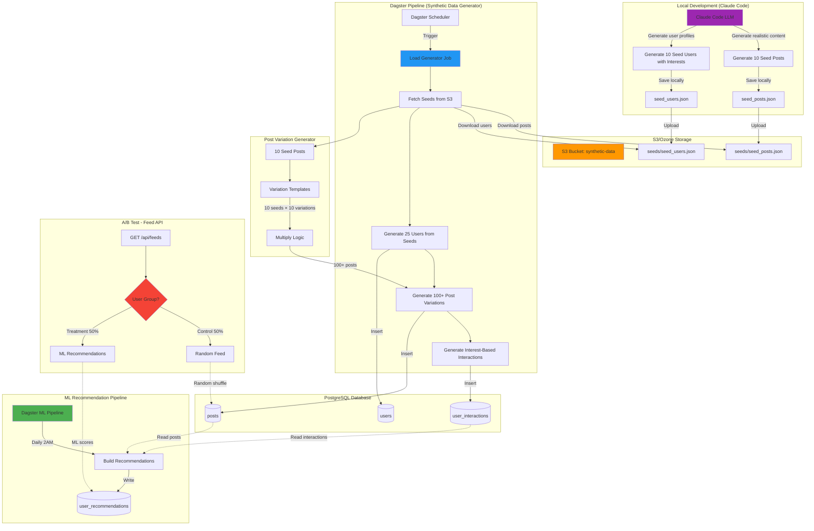

# Load Testing & A/B Test Architecture

## Overview

Generate synthetic realistic data to test ML recommendation system effectiveness.

## Architecture Diagram



## Components

### 1. Seed Post Generation (Claude Code - Local)

**Input:** Natural language prompts
**Output:** `seed_posts.json` (10 high-quality seed posts)

```json
{
  "seeds": [
    {
      "id": "seed_1",
      "topic": "technology",
      "content": "Just discovered this amazing new framework...",
      "tags": ["tech", "webdev", "react"],
      "tone": "enthusiastic"
    },
    {
      "id": "seed_2",
      "topic": "food",
      "content": "Made the best pasta carbonara today...",
      "tags": ["food", "cooking", "italian"],
      "tone": "casual"
    }
  ]
}
```

**Topics to Cover:**

- Technology (3 seeds)
- Food/Cooking (2 seeds)
- Travel (2 seeds)
- Sports (1 seed)
- Books/Learning (1 seed)
- Daily Life (1 seed)

### 1.5. Seed User Generation (Claude Code - Local)

**Input:** User profile requirements
**Output:** `seed_users.json` (10 user profiles with interests)

```json
{
  "seed_users": [
    {
      "id": "seed_user_1",
      "username": "tech_enthusiast",
      "display_name": "Alex Chen",
      "bio": "Full-stack developer | Open source contributor",
      "interests": ["technology", "programming", "ai"],
      "interaction_weight": {
        "technology": 0.7,
        "books": 0.2,
        "daily-life": 0.1
      }
    }
  ]
}
```

**User Archetypes:**

- Tech Enthusiast (technology + books)
- Foodie Explorer (food + travel)
- Travel Addict (travel + food)
- Sports Fan (sports + daily-life)
- Bookworm (books + technology)
- Casual Observer (mixed interests)
- Tech Foodie (technology + food)
- Adventure Reader (travel + books)
- Fitness Tech (technology + sports)
- Renaissance Soul (all topics)

**Interaction Weight:**

- Defines probability that user will interact with posts of each topic
- Sum of weights should be ~1.0
- Higher weight = more likely to view/like posts of that topic
- Used to generate realistic ML training data

### 2. S3/Ozone Upload

**Bucket Structure:**

```
synthetic-data/
├── seeds/
│   ├── seed_posts.json
│   └── seed_users.json
└── generated/
    └── run_YYYYMMDD_HHMMSS/
        ├── users.json
        ├── posts.json
        └── interactions.json
```

**S3 Configuration:**

- Provider: Ozone (S3-compatible)
- Bucket: `threads-synthetic-data`
- Access: Private, Dagster has read access

### 3. Dagster Load Generator Pipeline

**Job:** `generate_synthetic_data`

**Steps:**

```python
# Step 1: Fetch Seeds from S3
@asset
def seed_posts(s3_client):
    """Download seed posts from S3/Ozone"""
    seeds = s3_client.get_object(
        Bucket='threads-synthetic-data',
        Key='seeds/seed_posts.json'
    )
    return json.loads(seeds['Body'].read())

@asset
def seed_users(s3_client):
    """Download seed users from S3/Ozone"""
    seeds = s3_client.get_object(
        Bucket='threads-synthetic-data',
        Key='seeds/seed_users.json'
    )
    return json.loads(seeds['Body'].read())

# Step 2: Generate 25 Users from Seed Templates
@asset
def synthetic_users(seed_users):
    """
    Create 25 user profiles based on 10 seed user archetypes
    - Use seed users as templates (interests, interaction weights)
    - Add variations to usernames and display names
    - Preserve interest profiles for realistic interactions
    """
    users = []
    for i in range(25):
        # Cycle through seed users as templates
        seed_template = seed_users['seed_users'][i % 10]

        users.append({
            "username": f"{seed_template['username']}_{i:02d}",
            "display_name": f"{seed_template['display_name']} {i}",
            "bio": seed_template['bio'],
            "email": f"synthetic_user_{i}@synthetic.test",
            "interests": seed_template['interests'],
            "interaction_weight": seed_template['interaction_weight']
        })
    return users

# Step 3: Generate Post Variations (100+ posts)
@asset
def synthetic_posts(seed_posts, synthetic_users):
    """
    Multiply seed posts using variation templates
    10 seeds × 10 variations = 100 posts
    """
    posts = []
    for seed in seed_posts:
        for i in range(10):
            variation = apply_template(seed, i)
            posts.append({
                "user_id": random.choice(synthetic_users)["id"],
                "content": variation,
                "created_at": fake_timestamp()
            })
    return posts

# Step 4: Generate Interest-Based User Interactions (500+ interactions)
@asset
def synthetic_interactions(synthetic_users, synthetic_posts):
    """
    Generate realistic interaction patterns using user interest weights:
    - Users interact MORE with posts matching their interests
    - Use interaction_weight to bias post selection
    - Power law distribution (some posts get more interactions)
    - Time-based decay (recent posts get more views)
    """
    interactions = []
    for user in synthetic_users:
        # Each user views 20-40 posts
        num_views = random.randint(20, 40)

        # Weighted post selection based on user interests
        weighted_posts = []
        for post in synthetic_posts:
            # Get post topic from tags
            post_topic = get_post_topic(post)

            # Get user's interest weight for this topic (default 0.05)
            weight = user['interaction_weight'].get(post_topic, 0.05)

            # Add post multiple times based on weight (higher weight = more likely)
            weighted_posts.extend([post] * int(weight * 100))

        # Sample from weighted pool
        viewed_posts = random.sample(weighted_posts, min(num_views, len(weighted_posts)))

        for post in viewed_posts:
            # View interaction
            interactions.append({
                "user_id": user["id"],
                "post_id": post["id"],
                "interaction_type": "view",
                "created_at": fake_timestamp()
            })

            # Like probability also based on topic match
            post_topic = get_post_topic(post)
            like_probability = user['interaction_weight'].get(post_topic, 0.1) * 0.5

            if random.random() < like_probability:
                interactions.append({
                    "user_id": user["id"],
                    "post_id": post["id"],
                    "interaction_type": "like",
                    "created_at": fake_timestamp()
                })

    return interactions
```

### 4. Post Variation Templates

**Template Types:**

1. **Paraphrase** - Reword the content
2. **Add Context** - Add time/location details
3. **Add Emoji** - Insert relevant emojis
4. **Question Format** - Convert to question
5. **Personal Story** - Add personal angle
6. **Pro Tip** - Convert to advice format
7. **Short Form** - Condense to tweet-length
8. **Long Form** - Expand with details
9. **Casual Tone** - More informal
10. **Professional Tone** - More formal

**Example Variations:**

Seed: "Just discovered this amazing new framework..."

Variations:

1. "OMG just found this incredible framework! 🚀"
2. "Has anyone tried this new framework? Thoughts?"
3. "Pro tip: Check out this framework for your next project"
4. "Spent the weekend learning this framework. Mind blown!"
5. "Framework X is a game changer for web development"
   ... (10 total variations)

### 5. Feature Flag Implementation

**Database Change:**

```sql
ALTER TABLE users ADD COLUMN experiment_group VARCHAR(20) DEFAULT 'control';
-- Values: 'control' (random feed) or 'treatment' (ML feed)
```

**API Logic:**

```typescript
// app/api/feeds/route.ts
export async function GET(request: NextRequest) {
  const session = await auth()
  const user = await prisma.user.findUnique({
    where: { id: session.user.id },
    select: { experimentGroup: true },
  })

  if (user.experimentGroup === 'treatment') {
    // ML recommendations
    return fetchMLRecommendations(session.user.id, limit)
  } else {
    // Random feed (current Phase 1)
    return fetchRandomPosts(session.user.id, limit)
  }
}
```

### 6. Test Users Setup

**Create 2 Test Accounts:**

1. **User A (Control)** - `test_control@example.com`
   - `experiment_group` = 'control'
   - Gets random feed (Phase 1)

2. **User B (Treatment)** - `test_treatment@example.com`
   - `experiment_group` = 'treatment'
   - Gets ML recommendations (Phase 2)

**Visual Comparison:**

- Login as User A → See random posts
- Login as User B → See personalized ML recommendations
- Compare relevance by eye

## Implementation Timeline

### Phase 1: Seed Generation (Local - 30min)

- [x] Generate `seed_posts.json` with 10 high-quality seed posts ✅
- [x] Generate `seed_users.json` with 10 user archetypes and interest weights ✅
- [ ] Upload both files to S3/Ozone

### Phase 2: Dagster Load Generator (4h)

- [ ] Create Dagster job structure
- [ ] Implement S3 seed fetching
- [ ] Create user generator
- [ ] Create post variation templates
- [ ] Create interaction generator
- [ ] Test locally with small dataset

### Phase 3: Feature Flag (30min)

- [ ] Add `experiment_group` column to users table
- [ ] Update `/api/feeds` to check feature flag
- [ ] Create 2 test users (control/treatment)

### Phase 4: ML Pipeline (From existing plan)

- [ ] Build recommendation model
- [ ] Dagster ML job
- [ ] Populate `user_recommendations` table

### Phase 5: Visual Testing (15min)

- [ ] Login as User A → Random feed
- [ ] Login as User B → ML feed
- [ ] Compare results visually

## Success Criteria

✅ **Data Generation Working:**

- 10 high-quality seed posts
- 25+ synthetic users created
- 100+ post variations generated
- 500+ realistic interactions

✅ **A/B Test Working:**

- User A sees random posts
- User B sees ML-personalized posts
- Clear visual difference in relevance

✅ **ML Recommendations Working:**

- User B's feed matches their interaction history
- Posts ranked by predicted interest
- No duplicate recommendations

## Next Steps

1. **Done:** Draw architecture (this doc) ✅
2. **Done:** Generate 10 seed posts with Claude Code LLM ✅
3. **Done:** Generate 10 seed users with interest weights ✅
4. **Next:** Upload seeds to S3/Ozone
5. **Then:** Build Dagster load generator
6. **Finally:** Build ML recommendation pipeline
