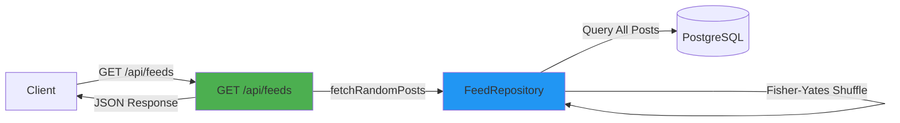
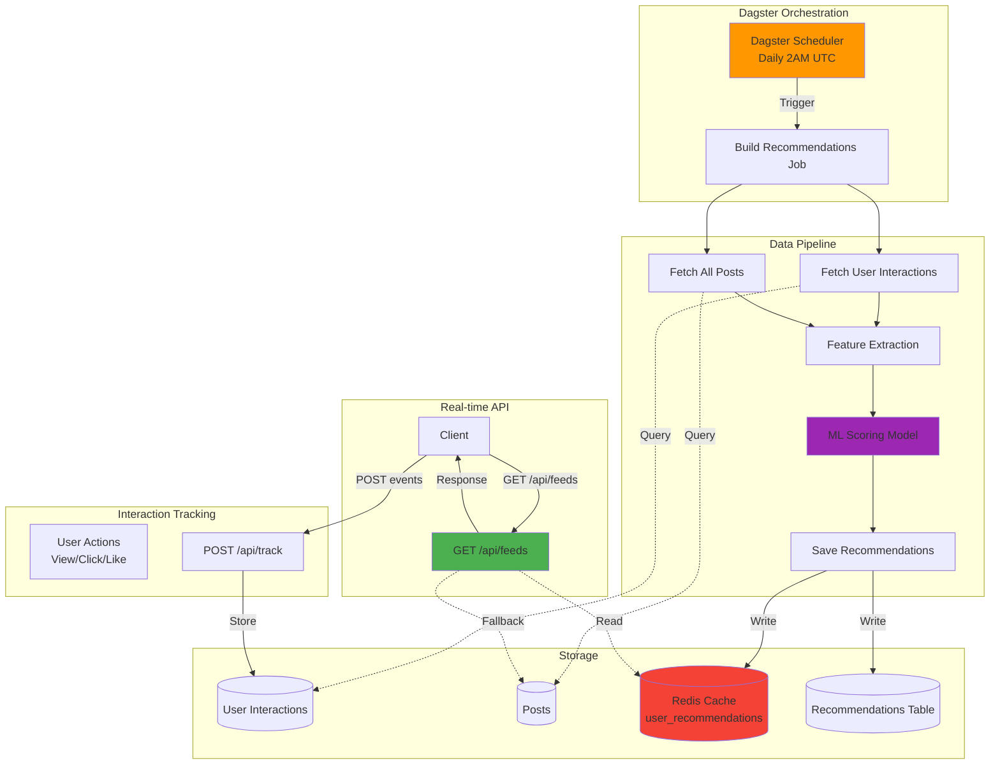
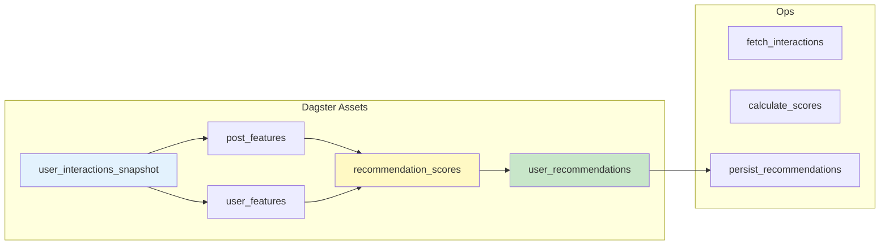

# Personal Recommendation System Design

> **Epic**: Implement personalized feed recommendations for Threads

## Table of Contents

- [Overview](#overview)
- [Architecture](#architecture)
- [Phase 1: Simple Random Recommendations](#phase-1-simple-random-recommendations)
- [Phase 2: ML-Powered Dagster Pipeline](#phase-2-ml-powered-dagster-pipeline)
- [API Specification](#api-specification)
- [Database Schema](#database-schema)
- [Implementation Timeline](#implementation-timeline)

---

## Overview

### Current State

The current `/api/posts` endpoint returns all posts in reverse chronological order (newest first), with a limit of 50 posts. This provides a simple feed but lacks personalization.

```typescript
// Current implementation
GET /api/posts → Returns all posts, ordered by createdAt DESC
```

### Goals

1. **Phase 1**: Implement simple random recommendations without ML
   - Quick win: Better than chronological feed
   - No infrastructure overhead
   - Foundation for Phase 2

2. **Phase 2**: ML-powered recommendations with Dagster pipeline
   - Batch processing for scalability
   - User interaction tracking
   - Periodic recommendation generation
   - Advanced ranking algorithms

---

## Architecture

### Phase 1: Simple Random Recommendations



**Key Features (Phase 1)**:

- Random post selection using Fisher-Yates algorithm
- Includes all posts (user can see their own posts)
- Pagination support (limit/offset)
- No external dependencies
- Stateless (no caching)

### Phase 2: ML-Powered Dagster Pipeline



**Key Components (Phase 2)**:

- **Dagster Pipeline**: Orchestrates batch recommendation generation
- **User Interaction Tracking**: Captures view, click, like events
- **ML Scoring Model**: Collaborative filtering or content-based
- **Redis Cache**: Fast access to pre-computed recommendations
- **Fallback Logic**: Random recommendations if cache miss

---

## Phase 1: Simple Random Recommendations

### Component Design

#### 1. FeedRepository

```typescript
// lib/repositories/feed.repository.ts
export class FeedRepository {
  /**
   * Fetch random posts for user's feed
   * - Excludes user's own posts
   * - Random shuffle using Fisher-Yates
   * - Includes user information
   */
  async fetchRandomPosts(
    userId: string,
    limit: number = 50,
    offset: number = 0
  ): Promise<PostWithUser[]>

  /**
   * Fisher-Yates shuffle algorithm
   * Time: O(n), Space: O(1)
   */
  private shuffleArray<T>(array: T[]): T[]
}
```

#### 2. API Endpoint

```typescript
// app/api/feeds/route.ts
export async function GET(request: NextRequest) {
  // 1. Authenticate user
  // 2. Get query params (limit, offset)
  // 3. Fetch random posts via FeedRepository
  // 4. Return JSON response
}
```

#### 3. Frontend Integration

```typescript
// components/feed.tsx
const fetchPosts = async () => {
  const response = await fetch('/api/feeds') // Changed from /api/posts
  // ... rest of logic
}
```

### Algorithm: Fisher-Yates Shuffle

```
For i from n−1 down to 1:
    j ← random integer in [0, i]
    swap array[i] and array[j]
```

**Complexity**:

- Time: O(n)
- Space: O(1) in-place

### Advantages (Phase 1)

✅ **Quick to implement** - No ML infrastructure needed
✅ **Better than chronological** - Users see varied content
✅ **No external dependencies** - Pure TypeScript
✅ **Stateless** - Easy to scale horizontally
✅ **Foundation for Phase 2** - Same API contract

### Limitations (Phase 1)

❌ Not personalized to user preferences
❌ No content freshness optimization
❌ No engagement-based ranking
❌ Inefficient for large datasets

---

## Phase 2: ML-Powered Dagster Pipeline

### Database Schema Changes

#### New Tables

```sql
-- User interaction events
CREATE TABLE user_interactions (
  id UUID PRIMARY KEY DEFAULT uuid_generate_v4(),
  user_id UUID NOT NULL REFERENCES users(id),
  post_id UUID NOT NULL REFERENCES posts(id),
  interaction_type VARCHAR(20) NOT NULL, -- 'view', 'click', 'like', 'share'
  created_at TIMESTAMP NOT NULL DEFAULT NOW(),
  metadata JSONB,

  INDEX idx_user_interactions_user_id (user_id),
  INDEX idx_user_interactions_post_id (post_id),
  INDEX idx_user_interactions_created_at (created_at)
);

-- Pre-computed recommendations
CREATE TABLE user_recommendations (
  id UUID PRIMARY KEY DEFAULT uuid_generate_v4(),
  user_id UUID NOT NULL REFERENCES users(id),
  post_id UUID NOT NULL REFERENCES posts(id),
  score FLOAT NOT NULL,
  generated_at TIMESTAMP NOT NULL DEFAULT NOW(),
  expires_at TIMESTAMP NOT NULL,

  UNIQUE(user_id, post_id),
  INDEX idx_user_recommendations_user_id (user_id),
  INDEX idx_user_recommendations_score (score),
  INDEX idx_user_recommendations_expires_at (expires_at)
);
```

### Dagster Pipeline Architecture



### ML Model Options

#### Option 1: Collaborative Filtering (User-User)

```python
# Pseudocode
similarity(user_a, user_b) = cosine_similarity(
  user_a.interactions,
  user_b.interactions
)

score(user, post) = weighted_sum(
  similar_users.interactions_with(post)
)
```

**Pros**: Simple, no feature engineering
**Cons**: Cold start problem, sparse data

#### Option 2: Content-Based Filtering

```python
# Pseudocode
post_features = extract_features(post.content)  # TF-IDF, embeddings
user_profile = aggregate(user.liked_posts.features)

score(user, post) = cosine_similarity(
  user_profile,
  post_features
)
```

**Pros**: No cold start, explainable
**Cons**: Limited diversity, feature engineering

#### Option 3: Hybrid Approach (Recommended)

```python
final_score = (
  0.4 * collaborative_score +
  0.3 * content_score +
  0.2 * recency_score +
  0.1 * engagement_score
)
```

### Dagster Job Configuration

```python
# dagster_pipeline/jobs/recommendation_builder.py

@job(
    resource_defs={"db": postgres_resource, "cache": redis_resource},
    config={
        "schedule": "0 2 * * *",  # Daily at 2AM UTC
        "batch_size": 1000,
        "lookback_days": 30,
    }
)
def build_user_recommendations():
    interactions = fetch_user_interactions()
    posts = fetch_recent_posts()

    scores = calculate_recommendation_scores(interactions, posts)
    recommendations = persist_recommendations(scores)

    cache_recommendations(recommendations)
```

### API Integration (Phase 2)

```typescript
// app/api/feeds/route.ts (Phase 2)
export async function GET(request: NextRequest) {
  const session = await auth()
  const userId = session.user.id

  // Try cache first
  const cached = await redis.get(`recommendations:${userId}`)
  if (cached) {
    return NextResponse.json({ posts: cached, source: 'cache' })
  }

  // Try database recommendations
  const recommendations = await feedRepo.fetchPrecomputedRecommendations(userId)
  if (recommendations.length > 0) {
    await redis.set(`recommendations:${userId}`, recommendations, 'EX', 3600)
    return NextResponse.json({ posts: recommendations, source: 'db' })
  }

  // Fallback to random
  const random = await feedRepo.fetchRandomPosts(userId)
  return NextResponse.json({ posts: random, source: 'fallback' })
}
```

### Infrastructure Requirements

- **Dagster**: Docker container for pipeline orchestration
- **Redis**: Cache layer for recommendations
- **PostgreSQL**: Additional tables for interactions/recommendations
- **Python Runtime**: ML model execution
- **Monitoring**: Pipeline success/failure alerts

---

## API Specification

### GET /api/feeds

**Description**: Fetch personalized feed for authenticated user

**Authentication**: Required (NextAuth session)

**Query Parameters**:
| Parameter | Type | Default | Description |
|-----------|------|---------|-------------|
| `limit` | number | 50 | Max posts to return (1-100) |
| `offset` | number | 0 | Pagination offset |
| `refresh` | boolean | false | Bypass cache (Phase 2 only) |

**Response (200 OK)**:

```json
{
  "posts": [
    {
      "id": "uuid",
      "userId": "uuid",
      "content": "Post content...",
      "mediaUrls": ["url1", "url2"],
      "createdAt": "2025-01-01T00:00:00Z",
      "updatedAt": "2025-01-01T00:00:00Z",
      "user": {
        "id": "uuid",
        "username": "alice",
        "displayName": "Alice Cooper",
        "avatarUrl": "https://..."
      }
    }
  ],
  "metadata": {
    "total": 50,
    "offset": 0,
    "limit": 50,
    "source": "random" // Phase 1: "random", Phase 2: "cache" | "db" | "fallback"
  }
}
```

**Error Responses**:

- `401 Unauthorized`: No valid session
- `400 Bad Request`: Invalid query parameters
- `500 Internal Server Error`: Server error

### POST /api/track (Phase 2 Only)

**Description**: Track user interaction events

**Request Body**:

```json
{
  "postId": "uuid",
  "interactionType": "view" | "click" | "like" | "share",
  "metadata": {
    "duration": 5000,
    "scrollDepth": 0.8
  }
}
```

**Response (201 Created)**:

```json
{
  "success": true,
  "interactionId": "uuid"
}
```

---

## Implementation Timeline

### Phase 1 (Week 1)

| Task                 | Effort | Dependencies      |
| -------------------- | ------ | ----------------- |
| Design doc           | 2h     | None              |
| FeedRepository       | 3h     | Prisma setup      |
| /api/feeds endpoint  | 2h     | FeedRepository    |
| Unit tests           | 3h     | /api/feeds        |
| E2E tests            | 2h     | /api/feeds        |
| Frontend integration | 1h     | /api/feeds        |
| Code review & deploy | 2h     | All tests passing |

**Total**: ~15 hours (2 working days) ✅ **COMPLETED**

### Phase 2 (Month 2-3)

| Task                     | Effort | Dependencies    |
| ------------------------ | ------ | --------------- |
| Database migrations      | 4h     | Schema design   |
| Interaction tracking API | 8h     | Database tables |
| Dagster setup            | 16h    | Infrastructure  |
| ML model development     | 40h    | Data collection |
| Pipeline integration     | 24h    | ML model        |
| Redis caching            | 8h     | Pipeline        |
| Monitoring & alerts      | 16h    | Pipeline        |
| Testing & validation     | 24h    | All components  |

**Total**: ~140 hours (4-6 weeks with team)

---

## Success Metrics

### Phase 1

- ✅ `/api/feeds` endpoint returns 200 OK
- ✅ Posts are randomized (not chronological)
- ✅ Includes all posts (user can see their own)
- ✅ 100% test coverage
- ✅ Response time < 500ms (p95)

### Phase 2

- 📈 User engagement +20% (time on app)
- 📈 Click-through rate +15%
- 📈 Daily active users +10%
- ⚡ Recommendation latency < 200ms (p95)
- 🎯 Pipeline success rate > 99%
- 🔄 Recommendations refresh daily

---

## Open Questions

1. **Phase 1**:
   - Should we exclude posts the user has already seen? (Requires tracking)
   - Should we factor in post age to prefer fresher content?

2. **Phase 2**:
   - Which ML model architecture? (Collaborative vs Content-based vs Hybrid)
   - How to handle cold start for new users/posts?
   - Should we use embeddings (requires GPU)?
   - What's the TTL for cached recommendations?

---

## References

- [Dagster Documentation](https://docs.dagster.io/)
- [Recommendation Systems - Stanford CS229](https://cs229.stanford.edu/)
- [Fisher-Yates Shuffle - Wikipedia](https://en.wikipedia.org/wiki/Fisher%E2%80%93Yates_shuffle)
- [Redis Best Practices](https://redis.io/docs/management/optimization/)
